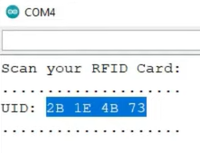
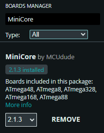

# Components List
## Electronic Components:
1. Arduino UNO x2
2. RFID MFRC522 x1
3. RFID Tags x2(at least)
4. 16x2 LCD Display x1
5. I2C Module for LCD Display x1
6. SG90 Servo x1
7. Buzzer x2
8. Different Color LED x9 (different colors according to preference)
9. Resistor (220 Ohm) x3
10. Resistor (10k Ohm) x1
11. Breadboard: Large 1x OR Medium 2x
12. Jumper Wire (Male to Male, Male to Female) x2(each)
13. Electric Wire (approx 10 feet)
14. HC SR 04 Ultrasonic Sensor x2
15. IR Obstacle Sensor Module x2
16. LDR sensor (5 mm) x1

## Tools:
1. Glue Gun 
2. Glue Gun Sticks x4
3. PVC Board (4 feet by 4 feet) x1 (For building the demo structure)
4. Anti-cutter
5. Cable Cutter
6. Thick Wire (For door lock mechanism)

---

# Full Setup & Installation Guidelines (Module-wise & Step by Step)
## Module 1: Access Authentication System
1. Ensure the circuit below is built before uploading the code.  
  

2. Open Arduino IDE.
3. Go to: Tools > Boards Manager.  

4. Search: "Arduino AVR Boards by Arduino" > Select Version: 1.8.6 > Install.  

5. Go to: Tools > Board> Manage Libraries > Search: "MFRC522 by Github Community" > Select Version: 1.4.10 > Install.  

6. Go to: Tools > Manage Libraries > Search: "LiquidCrystal_I2C by Martin Kobuvvcik, Frank de Brabander" > Select Version: 2.0.0 > Install.  

8. Connect the Arduino to the PC's USB port with the whole circuit setup.
9. Go to: Tools > Board > Arduino AVR Boards > Select: Arduino UNO.

10. Go to: Tools > Port > Select the port to which the Arduino is connected (If multiple ports are shown, try connecting one by one to find the actual port).
11. Now open the [RFID_UID_Program.ino](https://github.com/Fathin-Ishrak-Romeo/Sensor-based-Smart-Desk-with-Student-Access-Authentication-System-during-exam-using-Arduino/blob/main/Module%201%20Access%20Authentication%20System/RFID_UID_Program/RFID_UID_Program.ino) file in Arduino IDE & upload it.
12. Open the serial monitor from the top right of the Arduino IDE.
13. It will ask to Scan your RFID card.
14. Scan any of the RFID tags that you want to make the key.
15. Copy the UID that appears in the serial monitor.  

17. Now open the [Student_Access_Authentication_Program.ino](https://github.com/Fathin-Ishrak-Romeo/Sensor-based-Smart-Desk-with-Student-Access-Authentication-System-during-exam-using-Arduino/blob/main/Module%201%20Access%20Authentication%20System/Student_Access_Authentication_Program/Student_Access_Authentication_Program.ino) file in Arduino IDE.
18. Look for the variable named "String MasterTag" and replace the value in the variable with the previously copied UID.  

20. Save the program.
21. Upload it.
22. Open the [I2C_Scanner_Program_for_LCD_Display.ino](https://github.com/Fathin-Ishrak-Romeo/Sensor-based-Smart-Desk-with-Student-Access-Authentication-System-during-exam-using-Arduino/blob/main/Module%201%20Access%20Authentication%20System/I2C_Scanner_Program_for_LCD_Display/I2C_Scanner_Program_for_LCD_Display.ino) file in Arduino IDE & upload it.
23. Open the serial monitor from the top right of the Arduino IDE.
24. Copy the I2C address of the display (e.g. 0x27, 0x38, 0x39, 0x42, etc.)  

26. Now open the [Student_Access_Authentication_Program.ino](https://github.com/Fathin-Ishrak-Romeo/Sensor-based-Smart-Desk-with-Student-Access-Authentication-System-during-exam-using-Arduino/blob/main/Module%201%20Access%20Authentication%20System/Student_Access_Authentication_Program/Student_Access_Authentication_Program.ino) file in Arduino IDE.
27. Look for the function named "LiquidCrystal_I2C lcd" and replace the first parameter with the previously copied I2C address.  

29. Save the program.
30. Upload it.
31. Now, power the whole setup by connecting the Arduino cable to a 5V power source or PC, or by connecting the "Vin" pin of the Arduino UNO to the +ve terminal of a 5V power source and any of the "GND" pins to the -ve terminal of the power source.

---

## Module 2 Cheating Detection System
1. Ensure the circuit below is built before uploading the code.  
  
1. Connect the Arduino to the PC's USB port with the whole circuit setup.
2. Open Arduino IDE.
3. Go to: File > Preferences > Paste this link https://mcudude.github.io/MiniCore/package_MCUdude_MiniCore_index.json within the "Additional board manager URLs" section > Click "OK".

4. Go to: Tools > Board > Boards Manager.  

5. Search: "MiniCore by MCUdude" > Select Version: 2.1.3 > Install.  

6. Open the [Module_2_Cheating_Detection_Program.ino](https://github.com/Fathin-Ishrak-Romeo/Sensor-based-Smart-Desk-with-Student-Access-Authentication-System-during-exam-using-Arduino/blob/main/Module%202%20Cheating%20Detection%20System/Module_2_Cheating_Detection_Program/Module_2_Cheating_Detection_Program.ino) file in Arduino IDE.
7. Go to: Tools > Board > MiniCore > Select: "ATmege328"

8. Go to: Tools > Port > Select the port to which the Arduino is connected (If multiple ports are shown, try connecting one by one to find the actual port).
9. Upload it.
10. Now, power the whole setup by connecting the Arduino cable to a 5V power source or PC, or by connecting the "Vin" pin of the Arduino UNO to the +ve terminal of a 5V power source and any of the "GND" pins to the -ve terminal of the power source.
11. If you power the setup using a PC, then in the Arduino IDE, connect the port and open the serial monitor to see the real-time sensors' status.
12. To adjust the ultrasonic sensors' range and the LDR sensor's threshold, look for the "ldrThreshold" & "threshold" in the code. NOTE: The IDR sensor's threshold value should be within 0 to 1023.  

13. To adjust the range of the IR obstacle sensor modules, rotate the potentiometer attached to the module.

   
-----

# License
This project is licensed under the MIT License.
