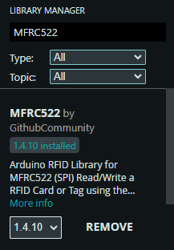

# Project Pic
        

---

# Problem & Motivation
During written exams, teachers cannot constantly monitor every student; unauthorized student access, unallocated seat occupying, and subtle cheating (looking at neighbors, using hidden phones) remain problems. A compact desk-attached system that enforces seat assignment and detects suspicious movement/light signatures can assist proctoring.

---

# Objective
Build a cost-efficient sensor-based prototype smart desk that (1) ensures only the authorized student can unlock and sit at a dedicated desk using RFID technology; and (2) during the exam, detects and signals to the teacher when a student looks left/right/front/back beyond a set distance or uses a concealed phone under the desk.

---

# System Architecture & Workflow
Two subsystems (modules)

### A. Student Access Control Subsystem:
This subsystem ensures that only the assigned student can use a particular desk.
- A green LED remains lit to indicate that the system is active.
- Input: Student ID scanned via RFID reader.
- Processing: Arduino compares the scanned ID against a list of valid IDs stored in memory.
- Outputs:
   - Valid ID:
     - A short buzzer beep with low sound.
     - System status green LED will be off, and another blue LED will be lit to indicate valid access.
     - LCD display shows “Access Granted: [Student ID]”.
     - Servo motor unlocks the desk for a limited time, then locks it again automatically.
   - Invalid ID:
     - A longer buzzer beep.
     - System status green LED will be off, and another red LED will be lit to indicate unauthorized access.
     - LCD display shows “Access Denied!!”.
     - Servo remains locked.
- When the student finishes their exam and wants to leave, they must scan their card again to unlock the desk, repeating the same process.
- The LCD is placed on the teacher’s desk so supervisors can monitor student entry and exit in real time.
- Status LEDs, servo, and the RFID scanner are placed on the student's desk.

### B. Cheating Detection Subsystem:
This subsystem continuously monitors student behaviour during the exam to detect potential cheating.
- Inputs:
     - Two ultrasonic sensors (HC-SR04): Detect left and right head movements.
     - Two IR obstacle sensors: Detect forward and backward leaning.
     - One LDR sensor: Detects abnormal brightness under the desk, such as a hidden mobile phone.
     - Processing: Arduino checks all sensor values against predefined thresholds. If a threshold is crossed, it identifies the direction or activity of the suspicious behaviour.
- Outputs:
     - A loud buzzer sound (short alert) to immediately notify the teacher.
     - A common LED and a corresponding LED (left, right, front, back, or phone indicator) lights up on the teacher’s desk.
     - LEDs remain lit slightly longer than the buzzer sound, allowing the teacher to identify both which student was flagged and what type of behaviour was detected.
       
This subsystem ensures that cheating attempts are quickly recognized without the need for cameras, making it privacy-friendly and cost-effective.

---

# Communication Protocols Used
1. SPI → used for fast & reliable communication between the Arduino UNO and the RFID reader.
2. I²C → used for efficient LCD display control with minimal pins.
3. GPIO (digital/analog) → used for simple and low-cost communication to all sensors, LEDs, buzzer, and servo.

---

# Components List
## Electronic Components:
1. Arduino UNO x2
2. RFID MFRC522 x1
3. RFID Tags x2(at least)
4. 16x2 LCD Display x1
5. I2C Module for LCD Display x1
6. SG90 Servo x1
7. Buzzer x2
8. Different Color LED x9 (different colors according to preference)
9. Resistor (220 Ohm) x9
10. Resistor (10k Ohm) x1
11. Breadboard: Large 1x OR Medium 2x
12. Jumper Wire (Male to Male, Male to Female) x2(each)
13. Electric Wire (approx 10 feet)
14. HC SR 04 Ultrasonic Sensor x2
15. IR Obstacle Sensor Module x2
16. LDR sensor (5 mm) x1

## Tools:
1. Glue Gun 
2. Glue Gun Sticks x4
3. PVC Board (4 feet by 4 feet) x1 (For building the demo structure)
4. Anti-cutter
5. Cable Cutter
6. Thick Steel Wire (For door lock mechanism)

---

# Full Setup & Installation Guidelines (Module-wise & Step by Step)
## Module 1: Student Access Authentication Subsystem
1. Ensure the circuit below is built before uploading the code.  
  

2. Open Arduino IDE.
3. Go to: Tools > Boards Manager.   
4. Search: "Arduino AVR Boards by Arduino" > Select Version: 1.8.6 > Install.  

5. Go to: Tools > Board> Manage Libraries > Search: "MFRC522 by Github Community" > Select Version: 1.4.10 > Install.  

6. Go to: Tools > Manage Libraries > Search: "LiquidCrystal_I2C by Martin Kobuvvcik, Frank de Brabander" > Select Version: 2.0.0 > Install.  

8. Connect the Arduino to the PC's USB port with the whole circuit setup.
9. Go to: Tools > Board > Arduino AVR Boards > Select: Arduino UNO.   
10. Go to: Tools > Port > Select the port to which the Arduino is connected (If multiple ports are shown, try connecting one by one to find the actual port).
11. Now open the [RFID_UID_Program.ino](https://github.com/Fathin-Ishrak-Romeo/Sensor-based-Smart-Desk-with-Student-Access-Authentication-System-during-exam-using-Arduino/blob/main/Module%201%20Access%20Authentication%20System/RFID_UID_Program/RFID_UID_Program.ino) file in Arduino IDE & upload it.
12. Open the serial monitor from the top right of the Arduino IDE.
13. It will ask to Scan your RFID card.
14. Scan any of the RFID tags that you want to make the key.
15. Copy the UID that appears in the serial monitor.   
17. Now open the [Student_Access_Authentication_Program.ino](https://github.com/Fathin-Ishrak-Romeo/Sensor-based-Smart-Desk-with-Student-Access-Authentication-System-during-exam-using-Arduino/blob/main/Module%201%20Access%20Authentication%20System/Student_Access_Authentication_Program/Student_Access_Authentication_Program.ino) file in Arduino IDE.
18. Look for the variable named "String MasterTag" and replace the value in the variable with the previously copied UID.  

20. Save the program.
21. Upload it.
22. Open the [I2C_Scanner_Program_for_LCD_Display.ino](https://github.com/Fathin-Ishrak-Romeo/Sensor-based-Smart-Desk-with-Student-Access-Authentication-System-during-exam-using-Arduino/blob/main/Module%201%20Access%20Authentication%20System/I2C_Scanner_Program_for_LCD_Display/I2C_Scanner_Program_for_LCD_Display.ino) file in Arduino IDE & upload it.
23. Open the serial monitor from the top right of the Arduino IDE.
24. Copy the I2C address of the display (e.g. 0x27, 0x38, 0x39, 0x42, etc.)   
26. Now open the [Student_Access_Authentication_Program.ino](https://github.com/Fathin-Ishrak-Romeo/Sensor-based-Smart-Desk-with-Student-Access-Authentication-System-during-exam-using-Arduino/blob/main/Module%201%20Access%20Authentication%20System/Student_Access_Authentication_Program/Student_Access_Authentication_Program.ino) file in Arduino IDE.
27. Look for the function named "LiquidCrystal_I2C lcd" and replace the first parameter with the previously copied I2C address.  

29. Save the program.
30. Upload it.
31. Now, power the whole setup by connecting the Arduino cable to a 5V power source or PC, or by connecting the "Vin" pin of the Arduino UNO to the +ve terminal of a 5V power source and any of the "GND" pins to the -ve terminal of the power source.

---

## Module 2: Cheating Detection Subsystem
1. Ensure the circuit below is built before uploading the code.  
  
1. Connect the Arduino to the PC's USB port with the whole circuit setup.
2. Open Arduino IDE.
3. Go to: File > Preferences > Paste this link https://mcudude.github.io/MiniCore/package_MCUdude_MiniCore_index.json within the "Additional board manager URLs" section > Click "OK".   
4. Go to: Tools > Board > Boards Manager.   
5. Search: "MiniCore by MCUdude" > Select Version: 2.1.3 > Install.  

6. Open the [Module_2_Cheating_Detection_Program.ino](https://github.com/Fathin-Ishrak-Romeo/Sensor-based-Smart-Desk-with-Student-Access-Authentication-System-during-exam-using-Arduino/blob/main/Module%202%20Cheating%20Detection%20System/Module_2_Cheating_Detection_Program/Module_2_Cheating_Detection_Program.ino) file in Arduino IDE.
7. Go to: Tools > Board > MiniCore > Select: "ATmege328".   
8. Go to: Tools > Port > Select the port to which the Arduino is connected (If multiple ports are shown, try connecting one by one to find the actual port).
9. Upload it.
10. Now, power the whole setup by connecting the Arduino cable to a 5V power source or PC, or by connecting the "Vin" pin of the Arduino UNO to the +ve terminal of a 5V power source and any of the "GND" pins to the -ve terminal of the power source.
11. If you power the setup using a PC, then in the Arduino IDE, connect the port and open the serial monitor to see the real-time sensors' status.
12. To adjust the ultrasonic sensors' range and the LDR sensor's threshold, look for the "ldrThreshold" & "threshold" in the code. NOTE: The IDR sensor's threshold value should be within 0 to 1023.  

13. To adjust the range of the IR obstacle sensor modules, rotate the potentiometer attached to the module.

   
-----

# Drawbacks & Scope of Improvement
1.  Dependency: Accuracy depends heavily on placement. While tuned to reduce false positives, false negatives (~20–25%) are still possible.
2. Ultrasonic Sensors: Sensitive to noise, reflections, or nearby movement. Can be improved by using PIR or ToF sensors (e.g., VL53L0X).
3. IR Obstacle Sensors: Affected by lighting and limited range. Could be replaced with shielded or break-beam IR sensors.
4. LDR Sensor: Ambient light changes reduce accuracy; students may shield phone screens. Digital light sensors (e.g., TSL2561) are more reliable.
5. RFID Security: Simple UID-based cards can be cloned. Use encrypted smart cards (e.g., MIFARE DESFire) and store credentials securely.
6. Limited Detection Scope: Only detects head turns, leaning, or phone light. Cannot identify advanced cheating (earpieces, hidden notes, gestures).
7. Scalability Issues: Each desk uses two Arduinos, raising cost and wiring complexity. A single Arduino/ESP32 with multiplexing or wireless could support multiple desks.
8. Teacher Monitoring: Hard to manage many desks. Centralized logging via SD card, server, or IoT platform (Firebase, ThingsBoard) with web/mobile dashboards would help.
9. No Event History: Current design only gives real-time alerts. Logging with timestamps would allow post-exam reviews.
10. False Positives: Natural movements may trigger alerts. Software filtering (averaging, debounce, ML-based classification) and adjustable thresholds would reduce errors.
11. Limited Feedback: LCD only shows access granted/denied. Should explain reasons (e.g., “Invalid Card”) and notify students when flagged.
12. Disruptive Alerts: Buzzer may disturb exams. Replace with silent vibration alerts or visual dashboards.
13. Mechanical Weakness: Servo lock may wear out. A more robust latch or solenoid lock is recommended.

# License
This project is licensed under the MIT License.
